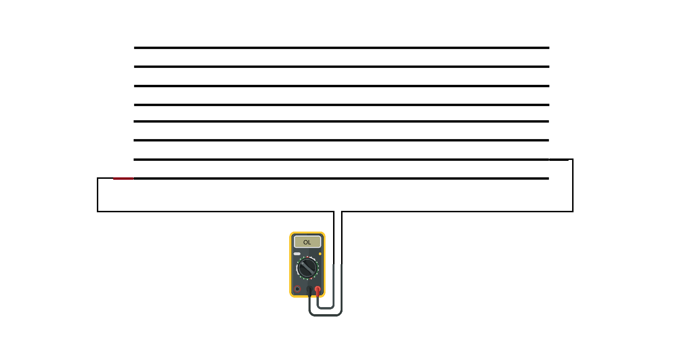

# Problem Statement

Develop an algorithm to **deterministically generate the minimal number of test sets** required to verify all isolation pairs in a wire harness.

Isolation testing ensures that no two wires are electrically connected. This is typically done by probing the pins of two wires and verifying that their resistance exceeds a specified threshold (e.g., >60 MΩ, or “OL” on a multimeter).

Consider the following 8-wire harness. Two wires (e.g., 7 and 8) are considered isolated if their measured resistance exceeds the threshold.



To verify full isolation, each unique wire pair must be individually tested (e.g., 1-2, 1-3, …).
Because isolation pairs are symmetric (1-2 ≡ 2-1), the number of unique tests is
$$
\frac{n(n-1)}{2},
$$
which still scales as **O(n²)**.

For a 50-pin harness, this results in 1,225 individual tests. When each test-such as an insulation resistance measurement-takes about one minute or more, a complete sequence can require several days.

---

# Solution

A dramatic reduction in complexity can be achieved by **testing groups of wires shorted together** against other groups, rather than testing each pair individually. The figure below (from a dielectric withstand test patent) demonstrates this principle:


Each wire harness can be modeled as a **set of nodes**, since each wire is continuous between its two ends. The set can be divided into two electrically isolated groups—for example:

A = [1, 2, 3, 4] and B = [5, 6, 7, 8]

Testing A vs B verifies the isolation of 16 pairs:
```
[
    (1,5), (1,6), (1,7), (1,8)
    (2,5), (2,6), (2,7), (2,8)
    (3,5), (3,6), (3,7), (3,8)
    (4,5), (4,6), (4,7), (4,8)
]
```

However, the challenge lies in algorithmically determining **which bipartitions** to use so that **all unique pairs** are eventually tested. For instance, an alternative split such as
A = [1, 3, 5, 7],  B = [2, 4, 6, 8]
tests a different subset of pairs. Across multiple bipartitions, the goal is for every wire to appear opposite every other wire at least once.

Put differently: each wire must be on the opposite side of the test boundary from every other wire in at least one configuration. The algorithm must therefore ensure full pairwise coverage across all bipartitions.

---

## Algorithmic Approach

This optimization problem maps directly to **non-adaptive group testing**.
By leveraging **binary encodings**, we can systematically construct the smallest possible set of bipartitions that guarantees all pairs are covered.

1. **Index the wires**: assign integer indices [0, 1, 2, 3, 4, 5, 6, 7].
2. **Convert each index to binary**. Each bit position defines one bipartition:

   * Wires with a 1 bit go to Group A.
   * Wires with a 0 bit go to Group B.
3. Because every index has a unique binary representation, any two indices differ in at least one bit position—ensuring that they appear in opposite groups in at least one test.

Example for n = 8 (wires 0-7). Test groups are determined from bit position 2 (highlighted):

| idx | **2** | 1   | 0   |
| --- | ----- | --- | --- |
| 0   | **0** | 0   | 0   |
| 1   | **0** | 0   | 1   |
| 2   | **0** | 1   | 0   |
| 3   | **0** | 1   | 1   |
| 4   | **1** | 0   | 0   |
| 5   | **1** | 0   | 1   |
| 6   | **1** | 1   | 0   |
| 7   | **1** | 1   | 1   |

Each bit position corresponds to a test configuration:

```
Test 1 (bit 2): [0,1,2,3] vs [4,5,6,7]
Test 2 (bit 1): [0,1,4,5] vs [2,3,6,7]
Test 3 (bit 0): [0,2,4,6] vs [1,3,5,7]
```

Since each index’s binary encoding differs from every other in at least one position, **all possible wire pairs** are covered across the three tests.

---

## Complexity Reduction

The required number of tests equals the number of bits needed to represent the largest index, i.e.
$$
\lceil \log_2 n \rceil.
$$

For a 50-wire harness:
$$
\lceil \log_2 50 \rceil = 6.
$$
Thus, the total number of tests drops from 1225 to just **6**.

In the context of dielectric withstand or insulation resistance testing, this translates to reducing total test duration from **multiple days to mere minutes**.

## Code
The following python code generates the set of bipart groups for a harness of N wires.

```python
pins = list(range(1, n + 1))
k = math.ceil(math.log2(n)) # total number of bipart groups

test_lists = []

for i in range(k):
    for idx, p in enumerate(pins):
        if (idx >> i) & 1 == 0:
            A.append(p)
        else:
            B.append(p)

    test_lists.append((A, B))
```